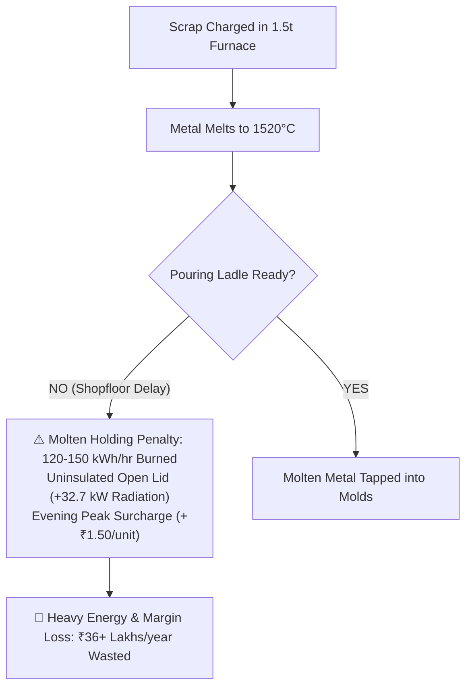
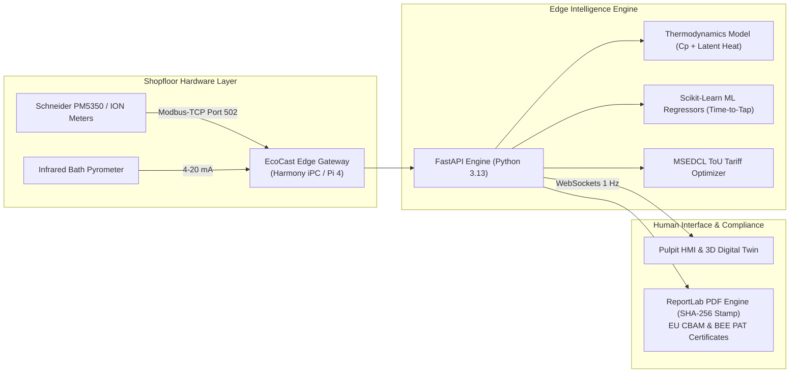
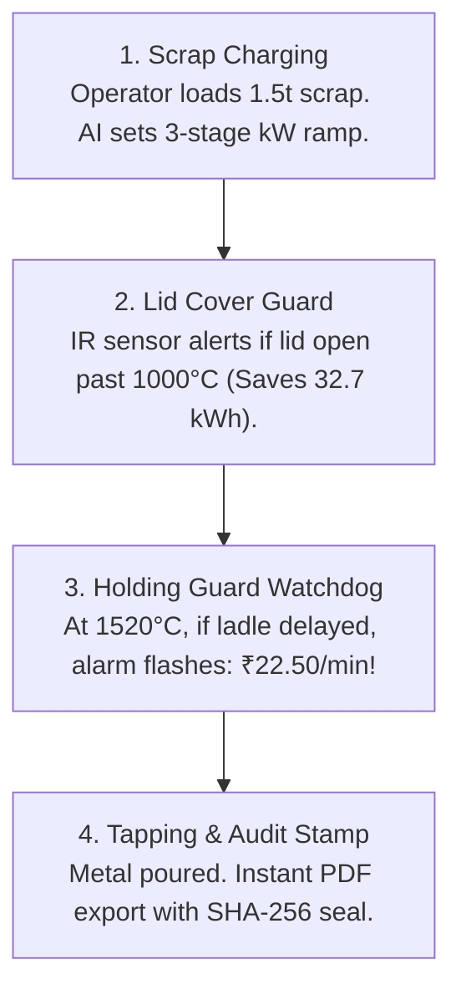

# PRESENTATION DECK SPECIFICATION: EcoCast AI

> **Target Deck:** 12-Slide Pitch Deck for Schneider Electric Yuva Yodha Energy Tech Hackathon 2026  
> **Challenge:** Challenge 4 — Smart Manufacturing: Industrial Energy & Process Efficiency  
> **Theme:** Clean Modern White Theme (`#FFFFFF` Canvas, `#F8FAFC` Cards, `#009530` Schneider Green, `#0F172A` Slate Navy)  
> **Audience:** Hackathon Jury, Plant Owners, and Non-Specialists (Clear visual analogies, zero industrial jargon confusion)  
> **Team:** Deepak R (Team Lead) & Saranya Dutta (Team Member, IIPE)  
> **Repository:** [https://github.com/Arkz-Deepak/yuva-yodha-hackathon](https://github.com/Arkz-Deepak/yuva-yodha-hackathon)  

---

## 🎨 Global Visual Theme Guidelines (For AI Presentation Agents & Human Reviewers)

* **Color Palette:**
  * **Canvas Background:** Pure White (`#FFFFFF`)
  * **Card / Section Backgrounds:** Ultra-light Slate (`#F8FAFC`) with subtle crisp borders (`#E2E8F0`)
  * **Primary Brand Accent:** Schneider Electric Official Green (`#009530` / `#16A34A`)
  * **Primary Typography:** High-contrast Slate Navy (`#0F172A`)
  * **Secondary / Body Text:** Slate Muted Grey (`#475569`)
  * **Highlights / Warnings:** Royal Blue (`#2563EB`) and Warm Amber (`#D97706`)
* **Layout:** 16:9 Widescreen, generous whitespace, structured card grids, visual flowcharts, and metric callout boxes.
* **Tone:** Pragmatic, visionary, mathematically grounded, and factory-ready.

---

## Slide 1: Title Slide (Hero)

* **Top Category Tag:** SCHNEIDER ELECTRIC YUVA YODHA ENERGY TECH HACKATHON 2026 • CHALLENGE 4
* **Main Title:** EcoCast AI
* **Subtitle:** Production-Aware AI Digital Twin & Tariff-Synchronized Melting Optimizer for MSME Foundries
* **Benchmark Context:** Kolhapur MSME Foundry Cluster, Maharashtra, India
* **Visual Asset:** Clean white card with Schneider Electric green header stripe and dual badges.
* **Project Team:**
  * **Deepak R (Team Lead)** — Systems Architect & Edge Developer | Full-Stack IoT, 3D WebGL Digital Twin, Modbus-TCP Ingestion
  * **Saranya Dutta (Team Member)** — Chemical Process Engineer | Roll No: `23CH10028` | `saranyadutta@iipe.ac.in` | Indian Institute of Petroleum and Energy (IIPE) | Process Thermodynamics, Energy Balances & EU CBAM/BEE Modeling
* **Live System Link:** Working full-stack application running with real-time WebSockets & 3D WebGL Digital Twin.

---

## Slide 2: The Problem: Decision-Level Energy Waste

* **Slide Title:** The Problem: Decision-Level Energy Waste in India's MSME Foundries
* **Beginner-Friendly Analogy:**
  > *"Think of an industrial induction melting furnace like a giant 500-kilowatt electric kettle. Melting scrap metal takes massive energy. But once it reaches 1520°C, if the pouring ladles aren't ready, the crew leaves the furnace running on full power to keep it hot. That idle holding burns 120–150 kWh every single hour—literally boiling money away into thin air!"*
* **The Kolhapur Reality:**
  * **300+ MSME Foundries:** Melt 600,000 tonnes of automotive castings annually.
  * **Energy is 30%–50% of Total Cost:** Electricity bills equal up to 19% of entire foundry revenue.
  * **Induction Furnaces are Power Hogs:** Consume over 70% of total plant electricity.
  * **High Specific Energy Consumption (SEC):** Average 780–900 kWh/tonne vs. global best-in-class benchmark of 550 kWh/tonne.
  * **The Hidden Culprit:** BEE audits confirm that **9% to 45% of waste is not broken machines—it is human decision delay!**
* **Embedded Graphic:** `docs/assets/fig1_problem_flowchart.png`

---

## Slide 3: Urgency & Regulatory Pressure

* **Slide Title:** Why It Matters Now: Single-Digit Margins & EU CBAM Carbon Tariffs
* **Two Simultaneous Pressures:**
  1. **Thin Profit Margins (4%–8%):**
     * MSME foundries operate on razor-thin profits.
     * With electricity averaging ₹8.50/kWh, **reducing furnace power by just 10% directly doubles net operating profit margins!**
     * Software-driven decision optimization delivers a verified **payback under 6.7 months**.
  2. **The 2026 EU CBAM Export Crisis (Carbon Border Adjustment Mechanism):**
     * Nearly **30% of Kolhapur castings are exported** to Europe and the USA for automotive and pump manufacturing.
     * EU CBAM began full commercial enforcement in 2026, penalizing carbon-heavy metal imports.
     * Indian castings carry carbon intensity of **~2.1 tCO₂/t** vs. the EU threshold of **1.5 tCO₂/t**.
     * Non-compliant exporters face border tariffs of **€79.68/tCO₂ (~₹7,450 per tonne)**, threatening export survival.
* **Key Takeaway:** MSMEs cannot afford multi-crore SCADA systems, but desperately need automated carbon accounting and energy intelligence.

---

## Slide 4: Proposed Solution & System Architecture

* **Slide Title:** The Proposed Solution: EcoCast AI Overview & System Architecture
* **The 3 Core Intelligence Pillars:**
  1. **Interactive 3D Digital Twin (Three.js):** Browser-based WebGL crucible showing live molten bath incandescence, coil heating states, open lid radiation loss, and hydraulic tilting.
  2. **Holding-Guard & Time-of-Use Watchdog:** Live monetary ticker (₹/min and kg CO₂/min) warning operators when molten metal idles. Shifts batch start times to hit MSEDCL night off-peak rebate windows (-₹1.50/kWh).
  3. **Automated Statutory Passports:** Instantly issues Form CA-26 compliance PDF certificates with SHA-256 digital seals for EU CBAM customs clearance and BEE PAT ESCert trading.
* **Embedded Graphic:** `docs/assets/fig2_solution_architecture.png`

---

## Slide 5: Operator User Journey

* **Slide Title:** Operator User Journey: Synchronized Melting from Scrap to Ingot
* **Designed for the Shopfloor:** Operates on a rugged tablet at the furnace melting pulpit with big, clear visual buttons.
* **The 4-Step Journey:**
  1. **Charge & AI Ramp:** Operator inputs scrap mass and grade (Grey Iron, SG Iron, Steel). AI sets optimal 3-stage power ramp (e.g. 720 kW → 520 kW → 640 kW) to prevent coil thermal shock.
  2. **Radiation Lid Guard:** Infrared sensor flags if furnace lid is open above 1000°C. Prompts operator to close cover, saving 32.7 kWh of thermal radiation per batch.
  3. **Holding Guard Alarm:** When metal hits target tapping temp (1520°C), if the crane or ladle isn't ready, an alarm flashes: *"Holding Loss Active: ₹22.50/min burned!"* Prompts crew to tap immediately or drop power.
  4. **Tapping & 1-Click Audit:** Furnace tilts, pours molten iron, and instantly generates a tamper-proof PDF audit certificate sealed with SHA-256 cryptography.
* **Embedded Graphic:** `docs/assets/fig3_operator_journey.png`

---

## Slide 6: Technical Approach (Thermodynamics & ToU Tariff)

* **Slide Title:** Technical Approach: Thermodynamics & Tariff-Synchronized Melting
* **Physics-Informed Optimization:**
  * **Energy Balance Formula:** Total energy required $Q = m \cdot C_p \cdot \Delta T + m \cdot L_f + Q_{losses}$.
  * **Phase Change Modeling:** Latent heat of fusion $L_f = 270\text{ kJ/kg}$ for iron melting.
  * **Stefan-Boltzmann Radiation Loss:** $Q_{rad} = \epsilon \cdot \sigma \cdot A \cdot (T_{bath}^4 - T_{amb}^4)$. Leaving the lid open at 1500°C leaks ~32.7 kW directly into ambient air!
* **MSEDCL Time-of-Use Tariff Arbitrage (Maharashtra HT-II Industrial):**
  * **Peak Hours (18:00 – 22:00):** +₹1.50/kWh penalty surcharge.
  * **Standard Day (06:00 – 18:00):** Baseline ₹8.50/kWh.
  * **Night Off-Peak (22:00 – 06:00):** -₹1.50/kWh rebate discount.
  * **Savings Impact:** Shifting just one 2,500 kWh heat from evening to night saves **₹7,500 in a single cycle!**
* **Embedded Graphic:** `docs/assets/fig4_tou_holding_chart.png`

---

## Slide 7: Strategic Alignment with Schneider Electric

* **Slide Title:** Strategic Fit: Extending EcoStruxure to 5,000+ MSME Foundries
* **The Market Expansion Opportunity:**
  * **Schneider EcoStruxure™:** World leader in enterprise energy management, serving massive steel plants and multinationals.
  * **The Untapped MSME Base:** India has 5,000+ MSME foundries that consume huge electrical loads but cannot afford multi-crore SCADA setups.
  * **EcoCast AI as 'EcoStruxure Edge MSME Gateway':** A lightweight, affordable software layer tailored specifically for MSME melting operations.
* **Commercial Hardware Synergy:**
  * Native driver integration with **Schneider EasyLogic™ PM5350, PM1200, and PowerLogic™ ION9000** power meters via Modbus-TCP.
  * Drives sales of Schneider current transformers, Harmony industrial edge PCs, and Altivar™ variable frequency drives (VFDs) for cooling water pumps.
  * Packaged as an out-of-the-box downloadable app on **Schneider Electric Exchange**.

---

## Slide 8: Regulatory Compliance (EU CBAM & BEE PAT)

* **Slide Title:** Statutory Compliance: EU CBAM Carbon Shield & BEE PAT Trading
* **Dual Regulatory Value Creation:**
  1. **EU CBAM Carbon Shield:**
     * Scope 2 Carbon Intensity: $\text{Embodied CO}_2 = \text{SEC (kWh/t)} \times 0.82\text{ kg CO}_2/\text{kWh}$ (CEA India Grid Factor).
     * EcoCast AI reduces furnace SEC from **820 kWh/t to 670 kWh/t**, dropping total carbon intensity from **2.15 tCO₂/t down to 1.76 tCO₂/t**.
     * Protects Kolhapur exporters from **€79.68/tCO₂ border penalties**, saving ~₹22.5 Lakhs annually in customs duties!
  2. **BEE PAT Scheme Revenue (ESCerts):**
     * Designated Consumers exceeding BEE Specific Energy Consumption targets receive tradable Energy Saving Certificates (1 ESCert = 1 Mtoe).
     * Traded on Indian Energy Exchange (IEX) at ~₹2,150/ESCert, adding **+₹4.3 to ₹7.1 Lakhs/year** in liquid balance-sheet revenue.
* **Embedded Graphic:** `docs/assets/fig5_cbam_carbon_chart.png`

---

## Slide 9: Quantified ROI & Financial Breakdown

* **Slide Title:** Quantified ROI: 6.7-Month Payback for a Typical MSME Foundry
* **Unit Economics (Representative 2,500 MT/year Foundry with 1.5t Furnace):**
  * **Holding Loss Elimination (30 min/heat):** Saves 216,000 kWh/yr = **₹18.4 Lakhs/yr**
  * **Night Tariff Shift (25% heats moved):** Saves **₹9.3 Lakhs/yr** in tariff discounts
  * **Lid Automation & Thermal Shielding:** Saves 52,300 kWh/yr = **₹4.4 Lakhs/yr**
  * **BEE ESCert Trading Revenue:** Adds **+₹4.3 Lakhs/yr** in tradable certificates
  * **Total Annual Economic Gain:** **₹36.4 Lakhs / year**
  * **Total Deployment Cost:** **₹2.0 Lakhs** (Edge Gateway + Modbus wiring + Software)
  * **Net Payback Period:** **6.7 Months!**
* **Environmental Impact:** Avoids **350–500 tonnes of CO₂** per plant per year.
* **Cluster Scale (300 Kolhapur Units):** **₹14 Crores** in annual collective energy savings!
* **Embedded Graphic:** `docs/assets/fig6_financial_roi_breakdown.png`

---

## Slide 10: Implementation Roadmap

* **Slide Title:** Implementation Roadmap: From Kolhapur Pilot to Cluster Scale
* **Phased Rollout Plan:**
  * **Q1: Pilot Baseline (Months 1–3):** Deploy edge gateways across 3 Kolhapur foundries (MIDC Shiroli & Gokul Shirgaon) with Schneider PM5350 meters. Validate non-invasive Modbus polling over 100 heat cycles.
  * **Q2: Shopfloor Pulpit Rollout (Months 4–6):** Install rugged operator touchscreens on melting pulpits. Train furnace crews on holding-guard alarms. Issue first batch of EU CBAM export certificates.
  * **Q3: Cluster Scaling (Months 7–9):** Partner with Kolhapur Engineering Association (KEA) & BEE to onboard 50 foundries across Kolhapur and Belgaum. Launch multi-furnace cloud dashboard for plant owners.
  * **Q4: Schneider Ecosystem (Months 10–12):** Certify application on Schneider Electric Exchange. Bundle software with Schneider Harmony iPC hardware. Expand to Rajkot, Coimbatore, and Ludhiana casting hubs.

---

## Slide 11: Demonstrated Feasibility: Working Full-Stack System Live Today

* **Slide Title:** Demonstrated Feasibility: Working Full-Stack System Live Today
* **Everything Built & Verified:**
  * **Interactive 3D Crucible Digital Twin:** Built with React 19, Three.js WebGL, and Tailwind CSS. Features real-time dynamic thermal incandescence, lid state warnings, and hydraulic tapping animations.
  * **High-Speed Asynchronous Backend:** Built with FastAPI (Python 3.13) and native WebSockets (`/ws/telemetry`), streaming 1 Hz real-time sensor packets.
  * **Schneider Modbus Driver:** Built-in Modbus-TCP driver reading registers for active power (kW), power factor, voltage, and current from PM5350 meters.
  * **Instant PDF & Cryptographic Verification:** Integrated ReportLab engine generating official Form CA-26 certificates with SHA-256 digital seals in < 500 ms.
  * **Cloud & Edge Deployable:** Verified on Render, Vercel, and local Docker/Windows containers.

---

## Slide 12: Team & Conclusion

* **Slide Title:** Team & Conclusion: Ready to Power India's Green MSME Transition
* **Dedicated Two-Member Team:**
  * **Deepak R (Team Lead):**
    * *Expertise:* Systems architecture, full-stack edge engineering, Three.js 3D WebGL digital twins, and industrial Modbus-TCP / WebSocket protocols.
    * *Contribution:* Developed the complete end-to-end software platform, live 3D twin, simulator engine, and PDF export system.
  * **Saranya Dutta (Team Member):**
    * *Affiliation:* Indian Institute of Petroleum and Energy (IIPE), Roll No: `23CH10028` | `saranyadutta@iipe.ac.in`
    * *Expertise:* Chemical process engineering, thermodynamic energy balances, metal fusion kinetics, and industrial decarbonization.
    * *Contribution:* Validated latent heat fusion models, furnace radiation losses, Specific Energy Consumption (SEC) benchmarks, EU CBAM carbon ledger math, and BEE PAT accreditation workflows.
* **Why EcoCast AI Wins Challenge 4:**
  1. **Solves a Massive Problem:** Targets the ₹14 Crore decision-level energy waste in India's highest-power MSME sector.
  2. **Not a Concept—Working Software:** Fully functioning code, 3D twin, and certificate generator running live right now.
  3. **Direct Schneider Hardware On-Ramp:** Expands Schneider's EcoStruxure footprint to 5,000+ underserved MSME foundries.
  4. **Unbeatable 6.7-Month Payback:** Proves that sustainability directly creates massive industrial profit.
